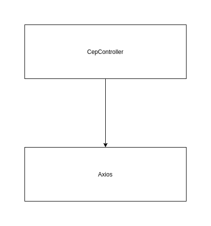
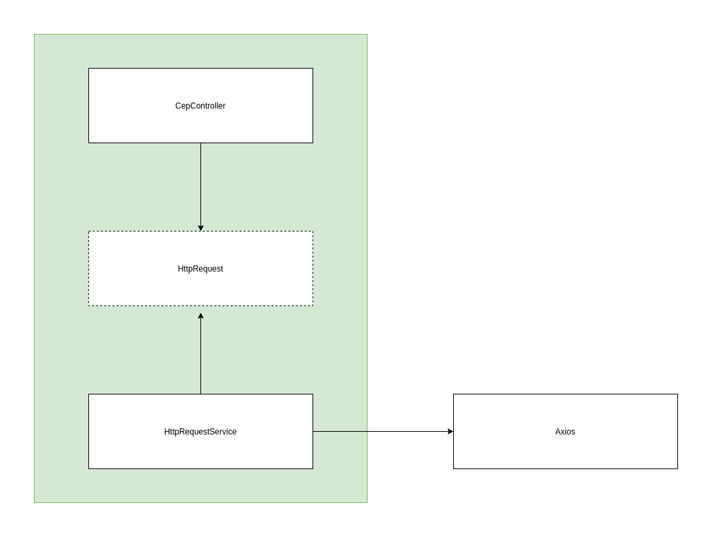

# :cool: Dependency Inversion
> Princípio da Inversão de Dependência - **Dependa de abstrações e não de implementações.**

### De acordo com Uncle Bob, esse princípio pode ser definido da seguinte forma
1. Módulos de alto nível não devem depender de módulos de baixo nível. Ambos devem depender da abstração.
2. Abstrações não devem depender de detalhes. Detalhes devem depender de abstrações.

### É comum
Geralmente utilizamos várias bibliotecas em nossos projetos, até ai tudo bem, tudo que puder facilitar nosso trabalho será sempre bem vindo. O único problema é quando ficamos presos a essas bibliotecas, e mudar começa a ficar muito custoso.

### Exemplos
Utilizei a biblioteca Axios que faz requisições Http para exemplificar o caso.
##### Sem princípios
> Nosso Controller é responsável por criar instâncias de bibliotecas externas.


##### Com princípios
> Nosso Controller não sabe qual biblioteca estamos utilizando. Ele só precisa receber uma classe que faça requisições Http. Dessa forma nós invertemos a dependência.


### Como executar?
```bash
npm install && npm run dev
```

### Créditos
:link: [#1 SOLID Principles & Design Patterns - Rodrigo Manguinho](https://www.youtube.com/watch?v=LTb89krmBP0&t=698s&ab_channel=Mango)
:link: [O que é SOLID - João Roberto da Paixão](https://medium.com/desenvolvendo-com-paixao/o-que-%C3%A9-solid-o-guia-completo-para-voc%C3%AA-entender-os-5-princ%C3%ADpios-da-poo-2b937b3fc530)